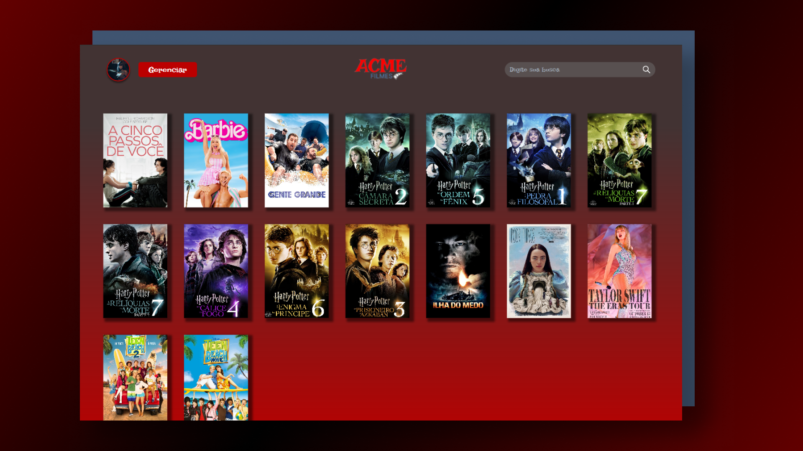

<h1 align="center">  ACME Filmes </h1>

<br>

<div align="center">  </div>

---
<br>

## 🤔 sobre o projeto
- Projeto desenvolvido na disiciplina de Programação Web Back-End II (PWBE II), no curso de Desenvolvimento de Sistemas no SENAI Jandira, orientado pelo professor Fernando Leonid e Marcel Teixeira.
- Projeto full-stack
- FrontEnd: Tailwind CSS e JavaScript
- BackEnd: Node.js
- Banco de Dados: MySQL 

<br>

##  📍 etapas do projeto (FrontEnd)

- [x] ```Todas as telas prototipadas foram criadas conforme figma?```
- [x] Criou pastas para separar os diversos tipos de arquivos?
- [x] Utilizou variáveis CSS para cores e padrões?
- [x] ```Foi utilizado o método GET para listar os filmes?```
- [ ] Criou alguma funcionalidade além do especificado no projeto?
- [x] ```Foi utilizado o método POST para cadastrar os filmes?```
- [x] Modularizou o projeto? ou seja, criou arquivos diferente dependendo da sua funcionalidade ou objetivo?
- [x] ```Foi utilizado o método PUT para modificar alguma informação dos filmes?```
- [x] ```Foi utilizado o método DELETE para excluir um filmes?```
- [x] Foi criado README.md do projeto?
- [x] Foi feito o deploy do projeto no GitHub Pages e outra plataforma?
- [x] Entregou o projeto prazo estipulado?

<br>

<br>

## 💻 linguagens e ferramentas utilizadas

<div>
  
  
  
  
  
  
</div>

<br>

## 👩‍💻 links
Protótipo | FRONT-END | Landing Page | CMS
----------|-----------|--------------|-----
[figma](https://www.figma.com/design/NaWa8mFYwjDYjS7yb9lGja/acme_filmes?node-id=0-1&t=zd4ksvOTILUgWbbG-0) | [projeto](https://github.com/gabfernandes8/acme_filmes) | [home](https://gabfernandes8.github.io/acme_filmes/frontend/viewer/src/assets/pages/home.html) | [cms](https://gabfernandes8.github.io/acme_filmes/frontend/viewer/src/assets/pages/cms_filme.html)


<br>


## 🌻 feito por:

<table>
  <tr>
    <td align="center">
      <a href="https://github.com/gabfernandes8">
        <br>
        <sub>
          <b>Gabriela Fernandes</b>
        </sub>
      </a>
    </td>
  </tr>   
</table>